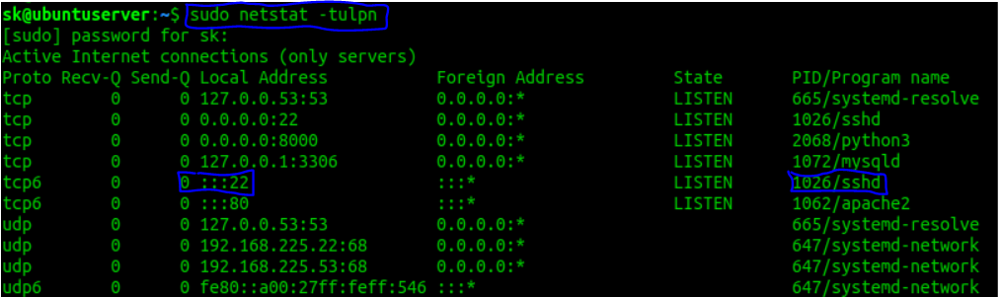
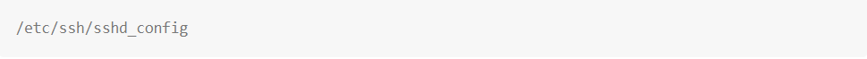

[doc01](doc01.md) | [doc02](doc02.md) | [doc03](doc03.md) | [doc04](doc04.md) | [doc05](doc05.md) | [doc06](doc06.md) | [doc07](doc07.md) | [doc08](doc08.md) | [doc09](doc09.md) | [doc10](doc10.md)

# 1. Montar Ubuntu Server en Maquina virtual con SSH habilitado.

1. **Descargar [Virtual Box](https://www.virtualbox.org/).**
2. **Descargar [Ubuntu Server](http://releases.ubuntu.com/16.04/ubuntu-16.04.6-server-i386.iso)(16.04.6).**
3. **Instalación de Ubuntu Server en la máquina  [Manual](https://www.redeszone.net/gnu-linux/ubuntu-server-18-04-lts-instalacion-configuracion/).**

   - *Recordad ejecutar el siguiente comando para **tener actualizada la lista de paquetes** en su ultima versión:*
   

4. **Habilitar SSH .**

    - *En la consola introduciremos el siguiente comando:*
    
    *Una vez ejecutado el comando , ya tendremos el SSH habilitado para conectarnos a nuestro servidor.*
    - Para comprobar que el puerto del servidor ssh esta escuchando, lo haremos con el siguiente comando, tiene que decirnos que el puerto 22 esta escuchando porque ese es el puerto por defecto del servidor ssh
    
    - *Para modificar la configuraración del servidor tendremos que acceder a la siguiente ruta:*
        

    - *Y por ultimo, recuerda ejecutar el siguiente **comando para reiniciar el servidor:***    
    
