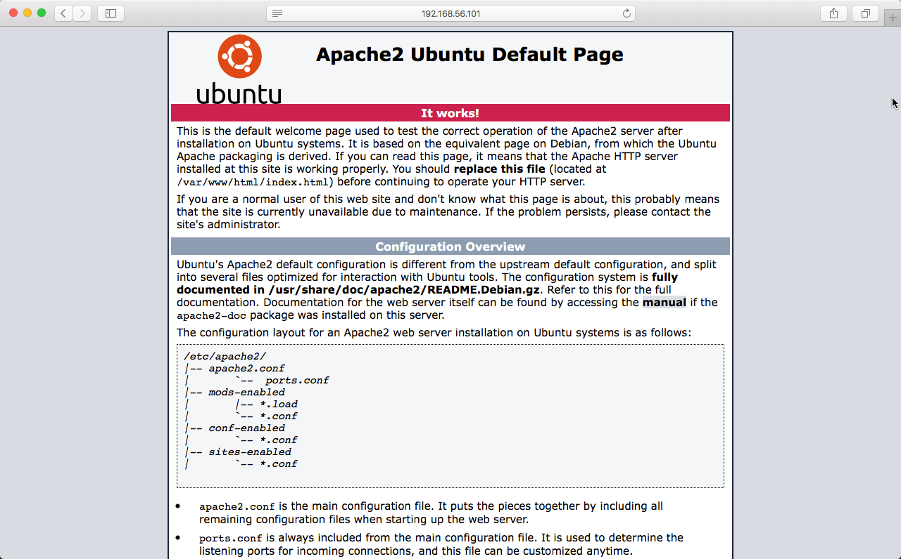
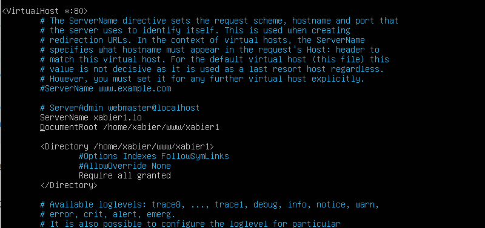

# 2. Implementar Servidor Apache y definir VirtualHosts para distintos proyectos.

1. Primero ejecutamos el comando **sudo apt update** para actualizar el índice de los paquetes locales :
```
sudo apt update
```
   Y después instalamos el paquete `apache2` ejecutando el siguiente comando :
```
sudo apt install apache2
```


2. Después copiamos el archivo **/etc/apache2/sites-available/000-default.conf** para configurar el virtual host de nuestro proyecto
y definimos el `ServerName` (nombre del dominio) y el `DocumentRoot` (ruta del proyecto) :
```
sudo cp /etc/apache2/sites-available/000-default.conf /etc/apache2/sites-available/xabier1.io.conf

sudo nano /etc/apache2/sites-available/xabier1.io.conf
```


3. Después habilitamos el archivo Virtual Host utilizando la herramienta `a2ensite` :
```
sudo a2ensite xabier1.io.conf
```