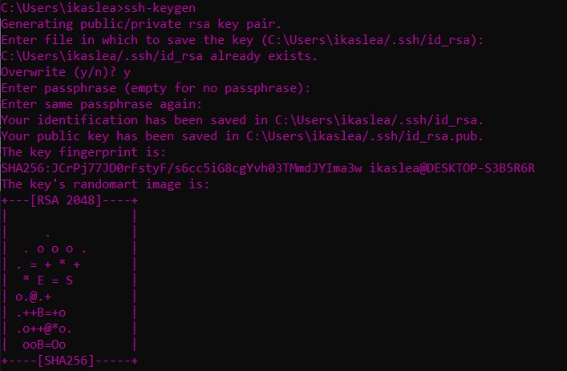

# Generar claves publica-privada y configurar servidor para conexión remota SSH sin contraseña.

1. Generar las llaves desde la parte del cliente:
Primero entras en el CMD de tu ordenador y escribes el comando `ssh-keygen`

2. Cambias el nombre de la llave publica a authorized_keys
  

3. Subir la llave publica al servidor

  *Es recomendable instalar [Link a wingw10](http://mingw-w64.org/doku.php)*

4. Le das permisos de lectura y escritura a la llave publica creada en el servidor
  
