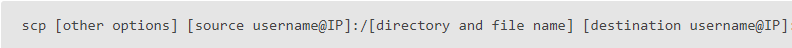
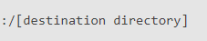
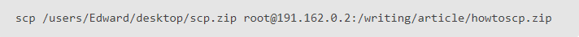

fin

# COMANDO SCP PARA COPIAR ARCHIVOS

2. Usar el comando scp para copiar archivos a un servidor.

##2. ESTRUCTURA DEL COMANDO SCP PARA COPIAR ARCHIVOS

 

- [other options] -> Sirve para hacer modificaciones con el comando SCP.
- [source username@IP] -> Es el usuario y la IP donde este el archivo que quieras copiar.
- [directory and file name] -> Es el nombre del archivo y donde está situado.
- [destination username@IP] -> Es el usuario y la IP de a donde quieres copiar el archivo (por ejemplo, del servidor).
- [destination directory] -> Es el sitio donde quieras dejar la copia hecha por el comando.

####Opciones que existen para las modificaciones por el comando SCP

- -P port nos permite especificar una entrada diferente al servidor.

- -c cipher nos permite especificar el algoritmo de cifrado que utilizará el cliente.

- -q hará que solo se muestren los errores críticos al ejecutar el comando.

- -r es para copiar de forma recursiva, incluyendo todos los subdirectorios.

- -4 o -6 sirve para cambiar la versión de protocolo (IPv4 o IPv6).

- -p se guardarán los tiempos de modificación iniciales y los atributos del archivo copiado.

- -u hará que el archivo desde el que se ha hecho la copia se borre, es decir el que esta en el destino de origen.

- -c comprimirá los datos mientras que se ejecuta el comando.

## EJEMPLOS DE COPIAS DE ARCHIVOS CON EL COMANDO SCP

####Archivo local a una ubicación remota

 - En caso de querer cambiar el nombre del archivo en el destino, se vería así:

####Archivo remoto a máquina local

####Archivo remoto a otra ubicación remota

 - En este caso deberás ingresar las contraseñas una vez ejecutado el comando.
 

