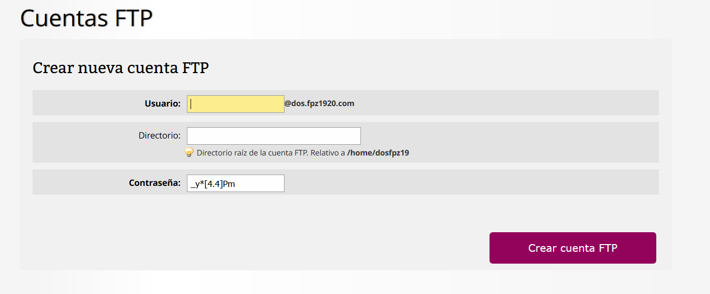
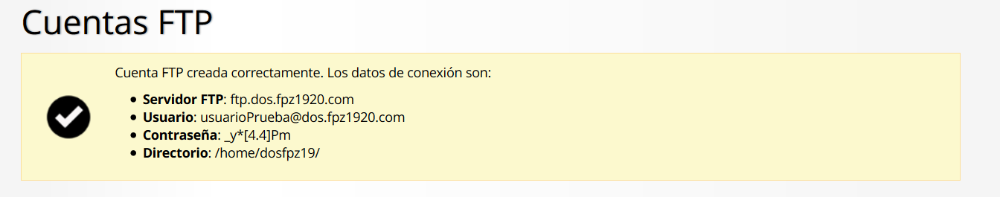
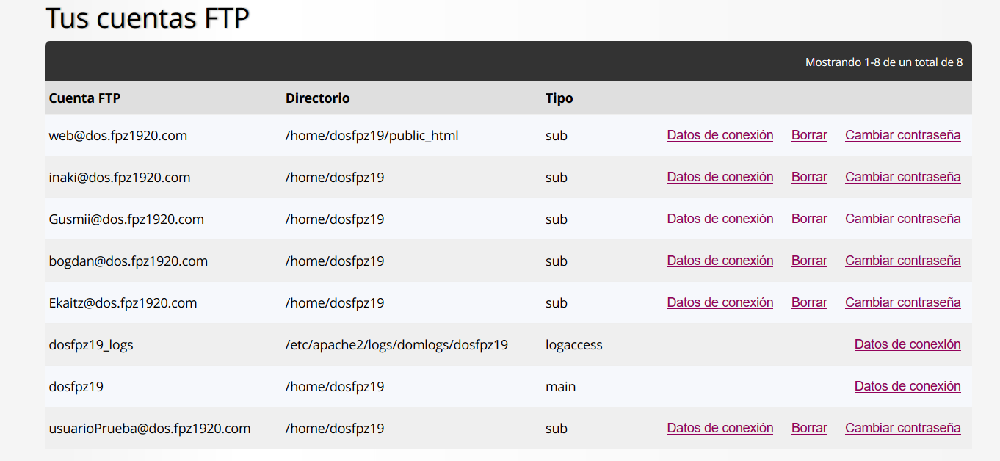
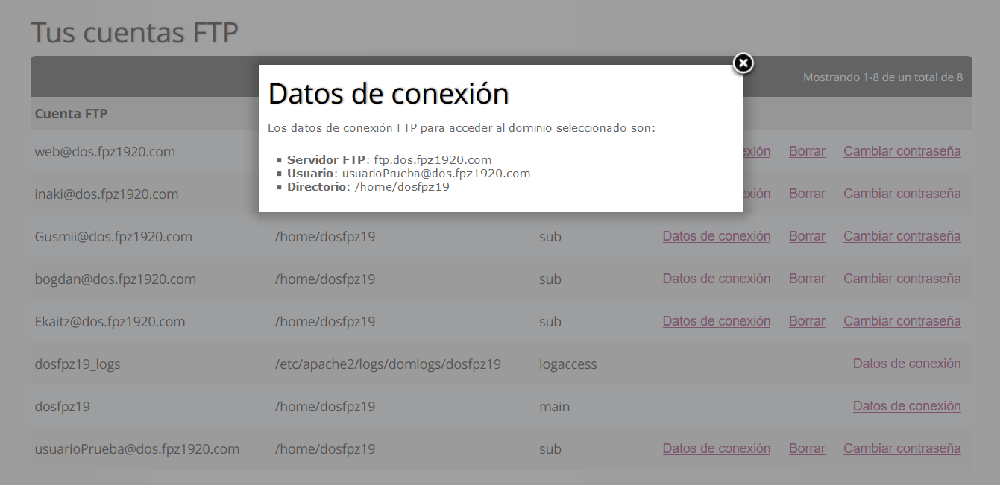
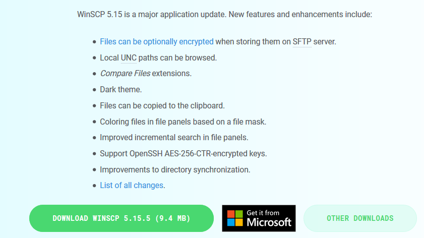
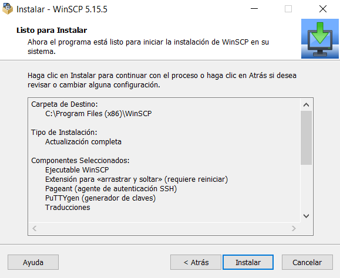
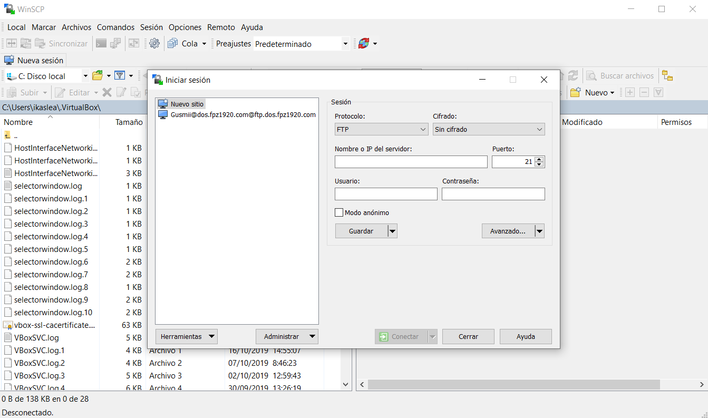
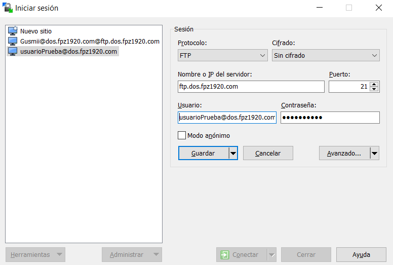
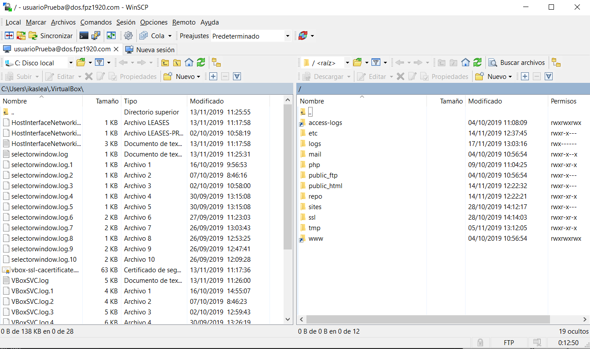

# Crear usuarios FTP en servidor y usar cliente FTP para subir archivos.

En esta guía aprenderéis a crear usuarios FTP y a gestionar archivos en el servidor de manera sencilla siguiendo unos simples pasos.

## 1.-Crear usurio FTP  	:bust_in_silhouette:

Para poder empezar necesitaremos un usuario que tenga acceso al servidor, para ello iremos al apartado de " *Cuentas FTP* ". 
En el encontraremos unos campos que tendremos que rellenar para crear el usuario.

>**Es recomendable ir guardando estos datos en un fichero para tenerlos en caso de emergencia.**

Una vez rellenados los campos ya tendremos un usuario creado, lo primero que veremos serán los datos necesarios para conectarnos al servidor.

En caso de querer comprobar los datos del usuario, bastará con ir al apartado de " *Cuentas FTP* " y ahí encontraremos una tabla con los usuarios que se encuentran en el servidor.

Bastará con hacer click en el link de *Datos de conexión* y se nos abrirá una pestaña con los datos de ese usuario.

## 2.-Descargar herramienta para conectarse al servidor :wrench:

Para poder conectarnos con el usuario que acabamos de crear , descargaremos un programa gratuito llamado " *WIN SCP* ". Basta con dar click [aqui](https://winscp.net/eng/download.php) y automaticamente te llevará a la página oficial para que puedas descargar el programa.

Una vez teniendo el instalador descargado, lo ejecutaremos y bastará con darle en el siguiente botón hasta terminar la instalación, no hace falta modificar nada en la instalación.

## 3.-Ejecutar Programa y guardar Sesion :globe_with_meridians:

Una vez tenieno el programa instalado, lo primero que haremos es ejecutarlo para poder conectarnos al servidor. Una vez dentro el programa nos pedirá que iniciemos sesión, para ello insertaremos los datos del servidor y del usuario que acabamos de crear.

 
>**Es recomendable guardar la sesión del usuario para no tener que estar introduciendo estos datos cada vez que quieras conectarte. Para poder guardar la sesion basta con hacer click en el botón de guardar.**

Una vez teniendo la sesion guardado nos conectaremos haciendo click en el boton de conectar, tras esperar unos segundos ya estaremos logueados y listos para subir archivos.

Con esto ya podríais empezar a gestionar los archivos.