# 7.Instalar Git y crear repositorio en servidor. Acceder a este repositorio desde cliente.

## Git en Servidor

* **Instala Git**
    * *Comprobar si está instalado ya*
    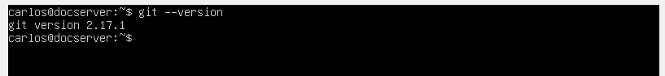
    
    * *Crea un nuevo repositorio llamado dweb (en tu home)*
        * mkdir repo 
        * cd repo
        * mkdir dweb.git
        * cd dweb.git
        * git init --bare
    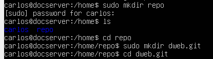
    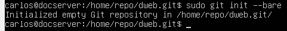

    * *Crear un HOOK post-receive*
        * cd /home/(usuario)/repo/dweb.git/hooks/
        * nano post-receive
            #!/bin/sh

            GIT_WORK_TREE=/home/<usuario>/www/dweb.io git checkout -f
        * guardalo
        * chmod 0775 post-receive
    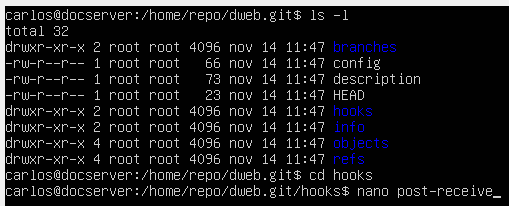
    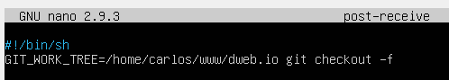
    

## Git en Cliente

* **Descargar e instalar MING**
    * *Editor: Nano*
    
    
    * *PATH:  Git from the command line*
    
    
    * *HTTPS: OpenSSL*
    
    
    * *Line endings: commit Unix-style*
    
   
    * *Terminal emulator: MinTTY*
    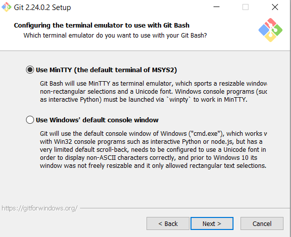
    
    * Extra Options:
        * Enable file system caching
        * Enable Git Credential Manager
    

* **Crea un espacio de trabajo para el proyecto DWEB**
    * Abre el terminal (MINGW) en tu espacio de trabajo.
        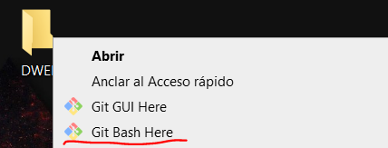
    
    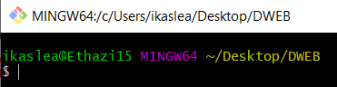
    
    * Haz un clon de tu repositorio: git clone (usuario)@(ip)):/home/(usuario)/repo/dweb.git
        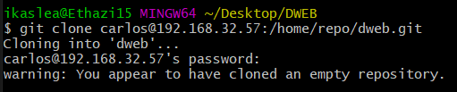
    
    * Crea un contenido (index.html) para tu proyecto y (usando comandos de Git) súbelo al repositorio
        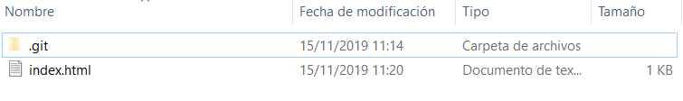
    * Configura tu usuario A NIVEL DE REPOSITORIO con git config --local user.name "User".... etc...
        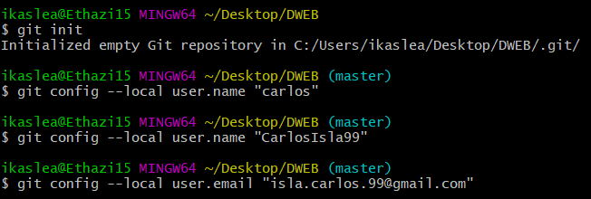

    

