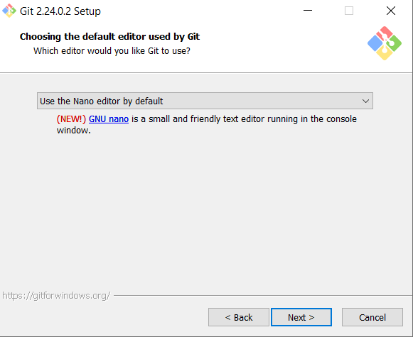
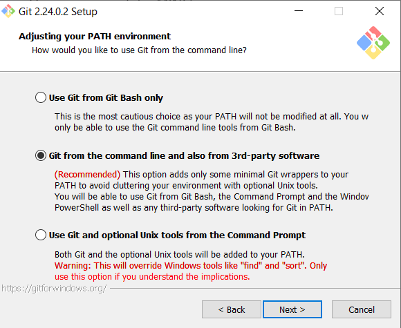
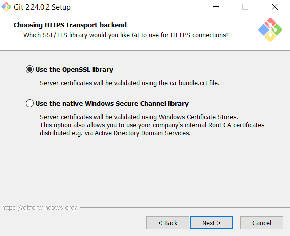
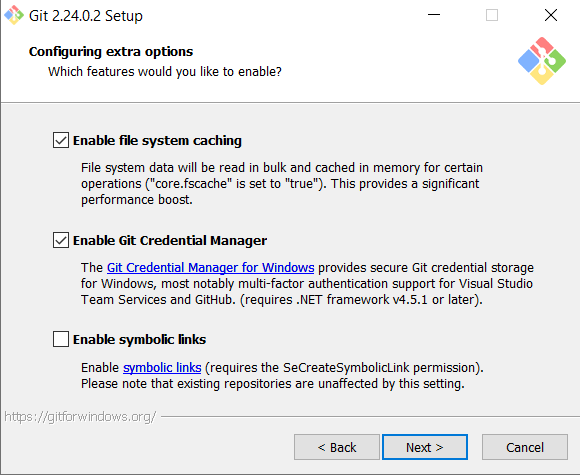

# 7.Instalar Git y crear repositorio en servidor. Acceder a este repositorio desde cliente.

* **Descargar e instalar MING**
    * *Editor: Nano*
    
     
    * *PATH:  Git from the command line*
    
     
    * *HTTPS: OpenSSL*
    
     
    * *Line endings: commit Unix-style*
    
     
    * *Terminal emulator: MinTTY*
    
     
    * Extra Options:
        * Enable file system caching
        * Enable Git Credential Manager
    
