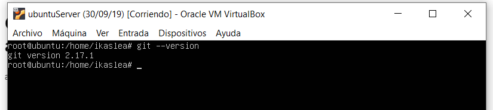

# Como crear un HOOK para habilitar un despliegue automatico 

<!---parte de Iñaki---->
al crear en el hook lo primero que tendremos que hacer es crear lo siguiente:
1.  Un script llamado deploy.sh que haga el git pull
2. Un PHP llamado deploy.php que ejecute dicho script

En el deploy.sh estará escrito lo siguiente:

*Nota: en este caso como ejemplo usaré __dosfpz19__ como nombre del dominio*
```bash

cd /home/dosfpz19/repo

rm -Rf nombreProyecto

git clone -b master [link del repositorio]

rm -Rf /home/dosfpz19/www/*

cp -rf nombreProyecto/* ../www
```

basicamente este script lo que hace es meterse en la carpeta repo y borrar todo el repositorio del proyecto para volver a clonarlo desde el git.

a continuacion crearemos el php que ejecutará dicho script:

```php
<?php

exec('./deploy.sh');

?>
```

El deploy.php solo se encarga de ejecutar el deploy, de ahi que solo sea una linea


<!-- BOGDDAN -->
##### No tengo muy calro como empezar  :D
#Desplaegar un Web-Hook 

* Item 1: Después de crear el repositorio en Git-Hub hay que irse a la configuración del repositorio:

