# 10. Desplegar proyecto privado alojado en GitHub en nuestro servidor público en GUEBS.
Estos son los pasos a seguir:

  - [Configurar Acceso SSH mediante clave publica-privada del servidor al repositorio GitHub](#configurar-acceso-ssh-mediante-clave-publica-privada-del-servidor-al-repositorio-github)
    1. [En nuestro servidor](#en-nuestro-servidor)
    2. [En GitHub](#en-github)

## Configurar Acceso SSH mediante clave publica-privada del servidor al repositorio GitHub

### 1. En nuestro servidor
Para conocer los **datos de acceso SSH** del servidor en GUEBS debes accede al **panel de control** de GUEBS Haz click ahí:
   
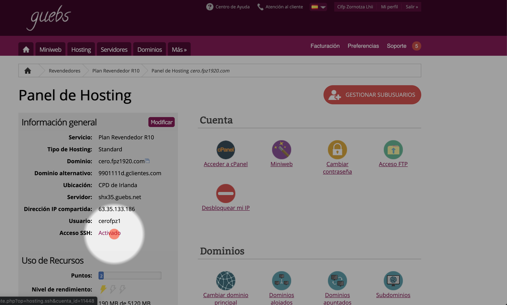

Copia los datos de conexión:

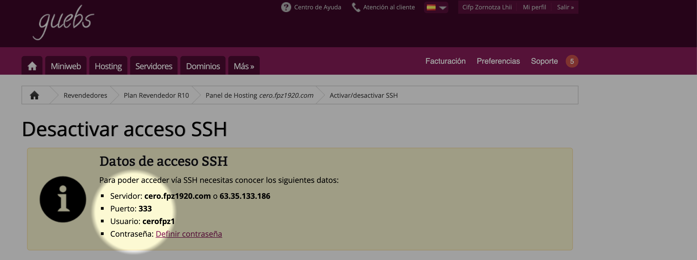

Si no recuerdas la contraseña del usuario SSH puedes poner una nueva pulsando en `Definir contraseña`

Abre un programa de **terminal** de linea de comandos que permita ejecutar el comando SSH. (OpenSSH client, Windows PowerShell o [MINGW](https://www.google.com/search?q=MINGW)) y ejecuta el comando SSH:

    ssh <usuario>@<ip> -p <puerto>

Te pedirá la contraseña.

Una vez conectado al servidor genera las llaves publica y privada mediante el comando `ssh-keygen`. Ponle un **nombre al archivo** pero y no escribas nada cuando te pida la `passphrase`, solamente pulsa Enter.

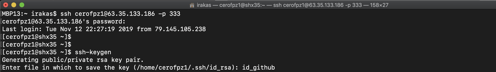

Esto habrá generado un par de claves publica-privada en el directorio actual. Escribiendo `ls -l` podrás visualizar una lista de los archivos.

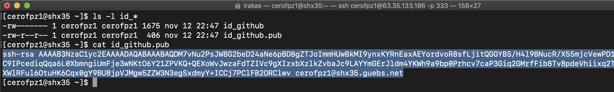

Ejecuta el comando **`cat`** seguido del nombre del archivo de la clave pública para mostrar su contenido, o abre el archivo con un editor como `nano`. Copia el contenido para llevarlo a [GitHub](https://github.com).

### 2. En GitHub
Accede a tu cuenta de GitHub *(con el usuario que te permita ver ese repositorio privado al que intentamos acceder)* y accede a `settings` en el icono de tu perfil.

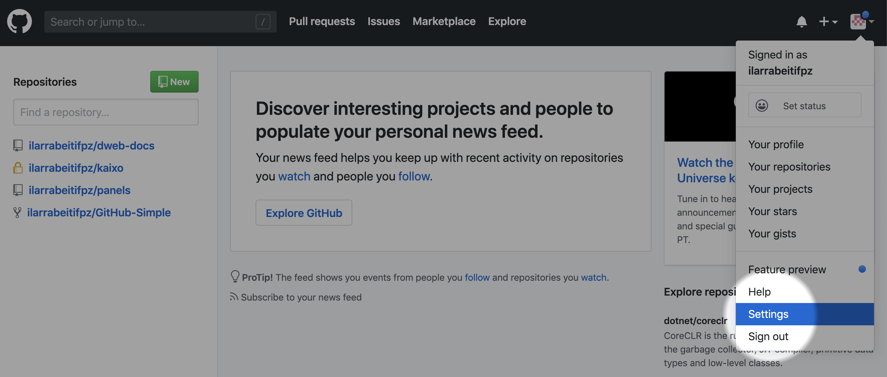

Después pulsa en la subsección `SSH and GPG keys` y en el apartado **SSH keys** pulsa el botón **New SSH key**

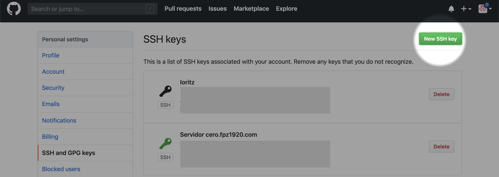

Y añade la clave publica del servidor que has copiado desde el terminal.

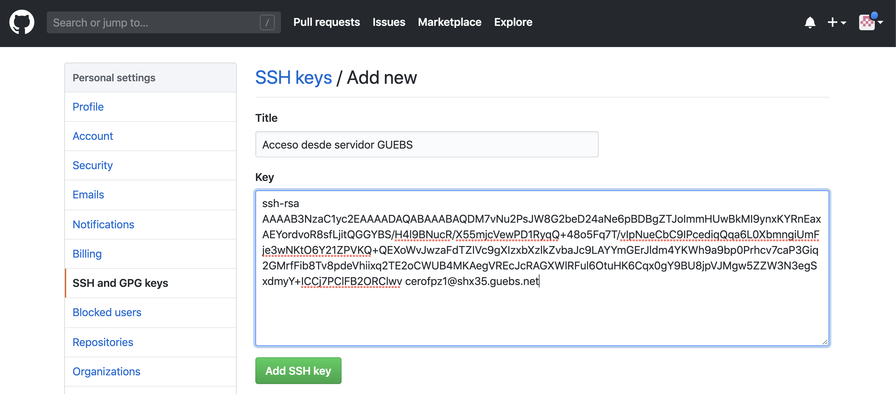

## Crear WebHook para el despliegue en el servidor GUEBS

Accede al repositorio de GitHub que quieras usar para el despliegue.

Dentro del repositorio entra a `Settings` y `WebHooks`.

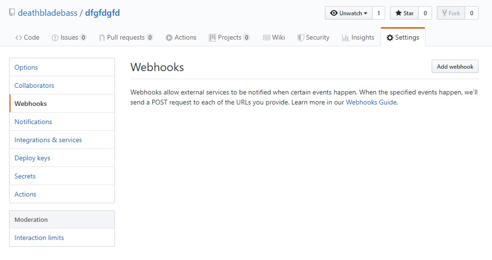

Haz click en `Add Webhook` y te pedira tu contraseña.

En esta nueva ventana apareceran diferentes opciones.

En `Payload URL` introduce la url que ejecutara el script.
En `Content Type` elige **application/json**.
Secret se quedara vacio.
`SSL verification` dejalo activado.
En el evento elige que solo tenga efecto cuando haga *push*.

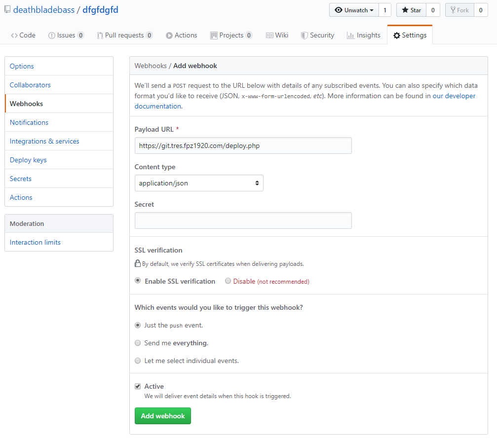

Una vez todo este relleno haz click en `Add webhook`, recargara la pagina y te mostrara el webhook que has creado.

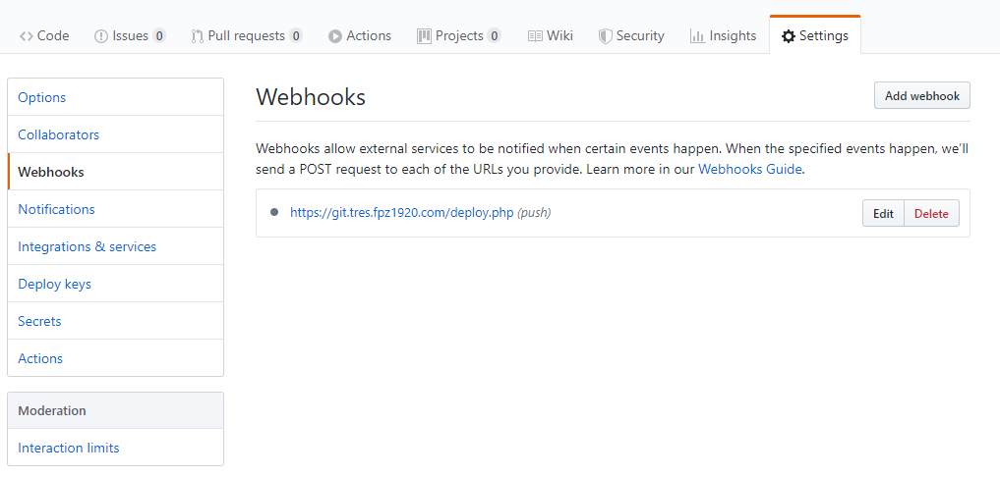

## Crear una un sub-dominio GIT para tener un espacio tipo git.{grupo}.fpz1920.com desde el panel de control del servidor.

Accede al panel de control de [Guebs](https://www.gestionservicios.online/login) con tu usuario.

Una vez dentro entra en la sección de subdominios.

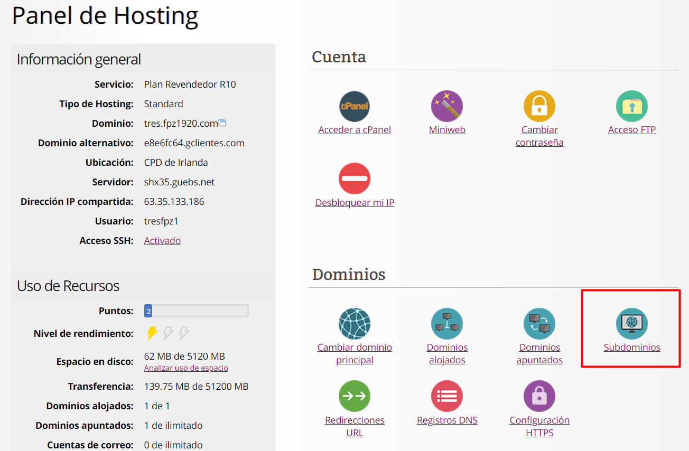

Al entrar en subdominios veremos un input donde añadiremos el nombre del subdominio **unicamente el nombre que ira por delante de nuestro dominio**. 

Cuando tengamos el nombre del subdominio elegido clickaremos en `Crear subdominio`.

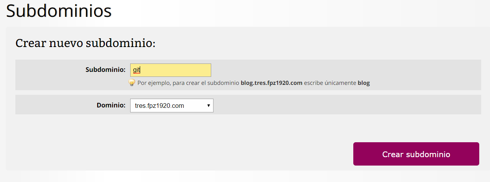

Finalmente podremos ver nuestros subdominios un poco más abajo.

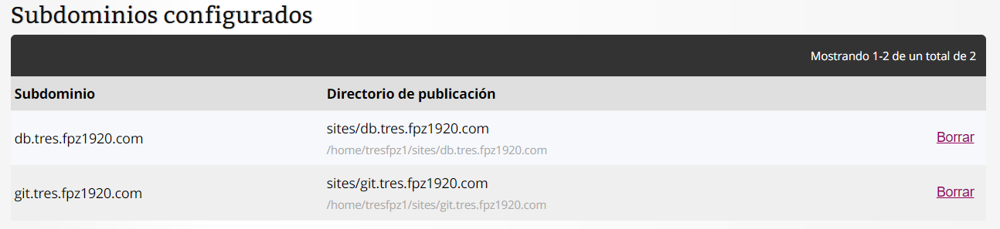

## Crear un archivo deploy.php en el site /home/<usuario>/sites/git.{grupo}.fpz1920.com/ que ejecute el script `deploy.sh`

En el buscador de Windows buscaremos `WinSCP` para conectarnos mediante ftp a nuestro dominio.

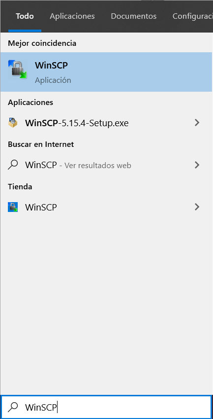

Para conectarnos a nuestro servidor pondremos los datos como aparece en la imagen *(cada uno tendra unos datos pero la estructura de ellas es la misma)*.

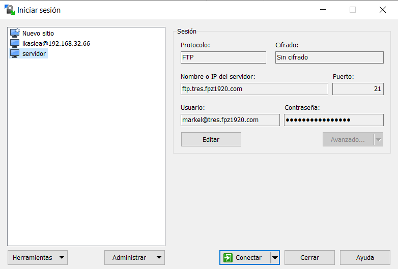

Una vez estemos en el servidor entraremos en la carpeta *sites*.

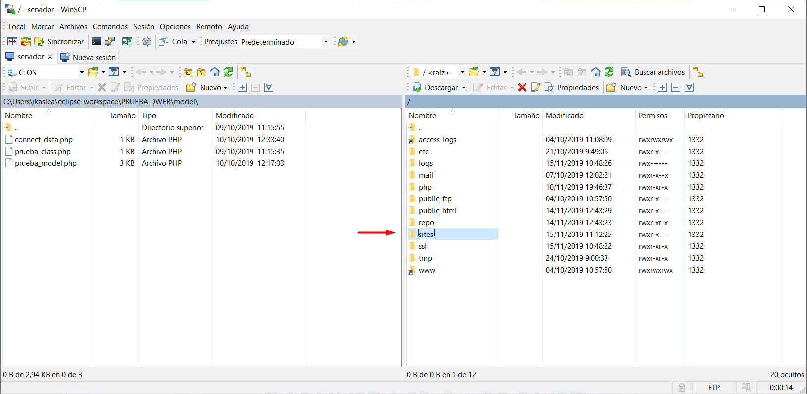

A su vez, dentro de la carpeta *sites* entraremos en el subdominio creado anteriormente para el *git*.

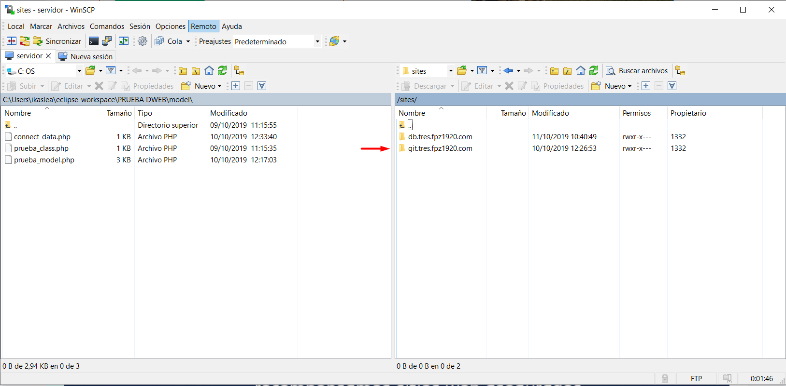

Aquí es donde crearemos el archipo `deploy.php` que ejecutara el script `deploy.sh` que también estara en este subdominio.

Para crear los archivos haremos click derecho dentro del subdominio elegiremos *nuevo* y después *archivo*.

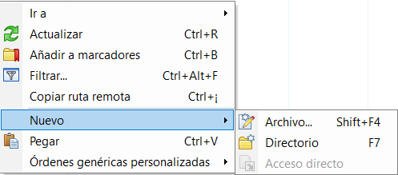

En el archivo `deploy.php` escribiremos lo siguiente:

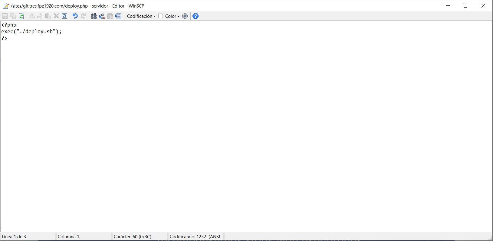

Una vez creado lo veremos dentro del subdominio.

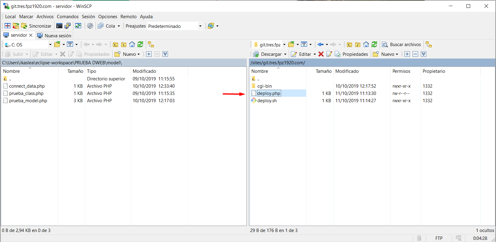

## Crear Script que haga el despliegue en el servidor GUEBS

Para crear el `deploy.sh` seguiremos de nuevo los pasos de antes para crear un archivo.

El script `deploy.sh`contendra el siguiente codigo:

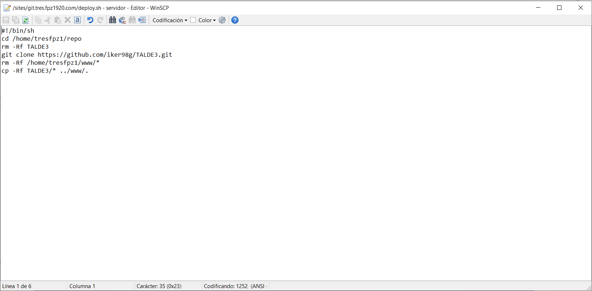

Una vez creado, nuevamente podremos verlo en el subdominio.

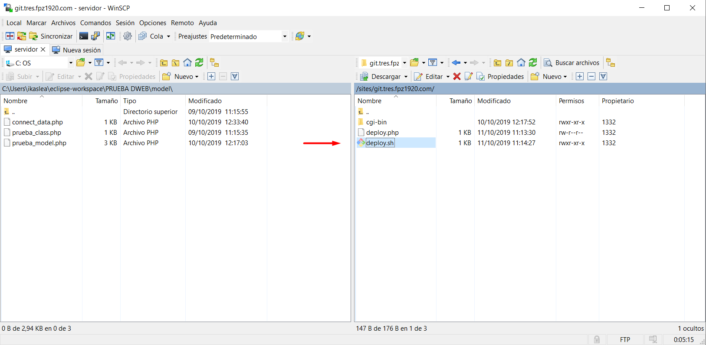

Finalmente, es hora de darle los permisos adecuados al scrip, en este caso los permisos son:
## 755

Para ello haremos click derecho sobre el archivo `deploy.sh` y clickaremos sobre *propiedades*.

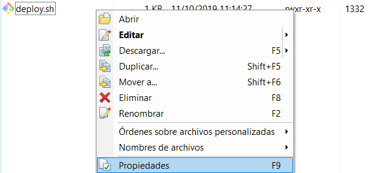

Al entrar en propiedades excogeremos los permisos de la siguiente manera *(también puedes escribir el codigo en la parte de octal)*:

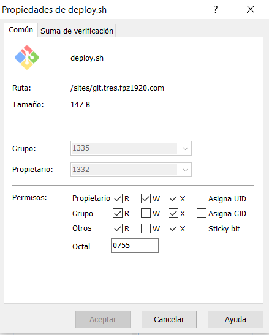